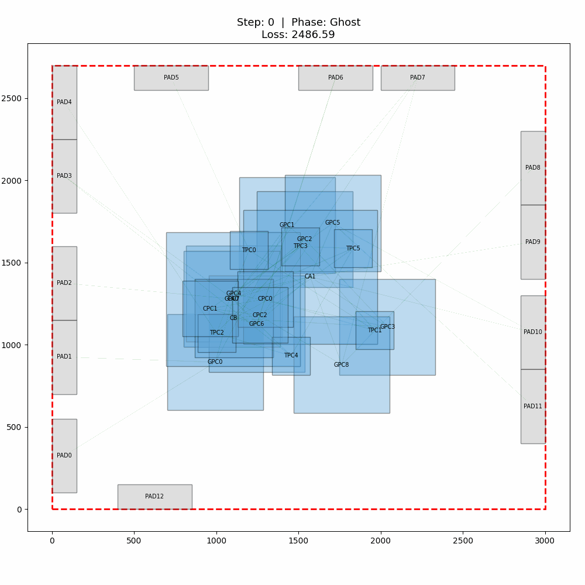
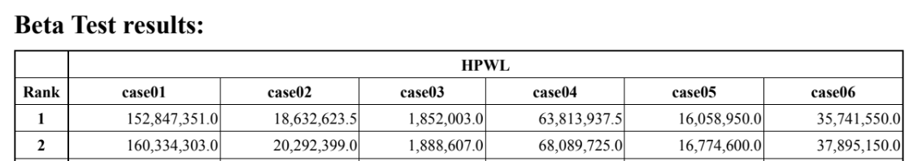

# Differentiable Floorplanner

> **用 PyTorch 梯度下降解決 VLSI Floorplanning 問題**  
> ICCAD 2023 Problem D — Fixed-Outline Floorplanning with Rectilinear Soft Blocks

本專案實作 ICCAD 2023 Problem D 的 **global optimization stage**：將 floorplanning 建模為**連續可微分最佳化問題**，利用 PyTorch 自動微分與梯度下降，同時優化所有模組的位置與形狀參數（aspect ratio）。在 CPU 上約 **~2 秒**可產出 **low-HPWL 的高品質初始解**（可能仍有少量 overlap / boundary violations），後續可將時間預算留給 **shape refinement** 與 **legalization**。

## 專案亮點

- **Differentiable Objective Formulation**：將 HPWL / overlap / boundary violations 建模為可微分目標函數。
- **核心目標函數向量化 (PyTorch Tensor Ops)**：以張量廣播與 `torch.relu` 等操作實作，pairwise overlap 計算為 O(N²)，適合中小規模原型與 contest-scale cases。
- **三階段訓練排程**：
  1. **Ghost (Attract)**：無視重疊，讓有連線的模組依賴 HPWL 自由聚攏。
  2. **Spread (Repel)**：逐漸增加 overlap penalty，加入遞減的 gradient perturbation 以促進模組分散。
  3. **Lock (Stabilize)**：維持高 overlap penalty，降低噪音，讓解收斂到接近可行的穩定狀態（後續仍需 legalization / shape refinement）。
- **PyTorch-native & GPU-ready**：核心訓練流程與目標函數皆以張量運算實作，可直接切換 CPU / CUDA。

## 專案結構

```
iccad2023_problemD/
├── main.py              # 執行入口
├── benchmark.py         # 批量評測腳本（輸出 Markdown 表格 + GIF）
├── src/
│   ├── parser.py        # 讀取 .txt 測資
│   ├── config.py        # 超參數與策略設定 (Fixed / Escalating)
│   ├── model.py         # 核心！可微分的 Floorplanner (nn.Module)
│   ├── trainer.py       # 訓練迴圈與權重動態排程
│   ├── metrics.py       # 評估指標
│   └── visualizer.py    # Matplotlib 互動動畫與截圖、錄影
├── data/
│   └── case01-input.txt ...
└── assets/
    └── case06_demo.gif  # README 展示用 GIF
```

## 安裝與執行

```bash
pip install -r requirements.txt
```

### 環境需求
- Python 3.8+
- `torch` (CPU 或 CUDA 版本皆可)
- `matplotlib`, `numpy`
- `Pillow` (產生 GIF 需安裝)、`ffmpeg` (產生 MP4 需安裝)

### 執行範例

```bash
# 預設執行 (escalating 策略，2000步)，會顯示互動動畫
python main.py --case data/case01-input.txt

# 使用 fixed 策略，跳過動畫直接看結果
python main.py --case data/case06-input.txt --strategy fixed --no-animation

# 指定儲存訓練過程為 GIF (需要 Pillow)
python main.py --case data/case01-input.txt --save-video result.gif --no-animation

# 強制使用 CPU 執行
python main.py --case data/case_large-input.txt --device cpu
```

## 實驗結果表現

每組實驗使用 **10 組隨機種子**，依 HPWL 排序後取 **Top-5** 計算平均（Top-5 mean = mean over the best 5 seeds, 2000 iterations, CPU）。兩種策略皆測試：

| Case | Strategy | Top-5 Mean HPWL | Best HPWL | Overlap (%) | Boundary | AR Viols | Time (s) |
|------|----------|----------|-----------|-------------|----------|----------|----------|
| case01 | escalating | 202,006,149 | 199,915,553 | 0.858 | 14.3 | 0 | 1.92 |
| case01 | fixed | 165,101,180 | 163,242,661 | 4.376 | 14.0 | 0 | 1.69 |
| case02 | escalating | 21,920,004 | 20,882,157 | 0.730 | 0.0 | 0 | 1.76 |
| case02 | fixed | 18,242,148 | 18,070,857 | 1.952 | 0.0 | 0 | 1.85 |
| case03 | escalating | 2,122,805 | 2,069,443 | 0.050 | 0.0 | 0 | 1.98 |
| case03 | fixed | 2,022,428 | 1,963,565 | 0.096 | 1.1 | 0 | 1.91 |
| case04 | escalating | 72,223,009 | 68,794,596 | 0.117 | 0.0 | 0 | 1.82 |
| case04 | fixed | 56,661,863 | 53,343,035 | 3.537 | 0.0 | 0 | 1.89 |
| case05 | escalating | 18,701,947 | 17,698,166 | 0.941 | 1.4 | 0 | 1.81 |
| case05 | fixed | 17,130,867 | 16,673,674 | 1.232 | 0.2 | 0 | 1.81 |
| case06 | escalating | 39,052,292 | 38,916,166 | 0.063 | 0.0 | 0 | 1.89 |
| case06 | **fixed** | **35,702,662** | **35,608,955** | **0.228** | 0.0 | 0 | 1.89 |

> **Overlap (%)** = 重疊面積 / 晶片面積 × 100。`escalating` 策略更積極消除重疊，通常可將 overlap 壓到 <1%；`fixed` 以更低 HPWL 為優先，部分案例 overlap 可能 >1%。  
> 在 global optimization 階段（legalization 之前），本方法可產出 low-HPWL 的高品質初始解，適合作為後續 legalization 的輸入。

### Case06 — Fixed 策略訓練過程

> Case06 在 `fixed` 策略下展現很好的 trade-off（HPWL vs overlap）：在維持低 overlap（0.228%）的同時取得全案例中最低的 Best HPWL（35,608,955）。



### 評估指標

使用 `benchmark.py` 可重現上述結果：

```bash
# 完整 benchmark（含 GIF 生成）
python benchmark.py --gif

# 僅跑特定 case
python benchmark.py --cases 4 6

# 儲存 JSON 結果
python benchmark.py --json results.json
```

## Comparison with Official Beta Test (ICCAD 2023)

官方 beta-test leaderboard 公布各 case 的 HPWL 排名。以 **case06** 為例，本方法 `fixed` 策略取得 **Best HPWL = 35,608,955**，低於公布之 **Rank 1 HPWL = 35,741,550**。本段僅針對 case06 的 HPWL 做數值對照。HPWL is better when lower.

> **Note:** 本專案僅涵蓋 *global optimization* 階段，不含競賽完整的 legalization / shape-refinement pipeline，因此結果並非嚴格的 apples-to-apples 比較。

官方 beta-test 結果表：[Official beta-test PDF](https://drive.google.com/file/d/1EoPhOKgB1w9puVii1_AiKeMJ1VjRQZAO/view)

## Reproducibility

上述結果在以下環境測試通過：

| Item | Version |
|------|---------|
| Python | 3.9.12 |
| PyTorch | 2.3.1 (CPU) |
| NumPy | 1.26.4 |
| Matplotlib | 3.9.0 |
| OS | Windows 10/11 |

不同版本的 PyTorch 或不同硬體可能產生微小的數值差異，但整體趨勢應一致。Seed 與設定可透過 `benchmark.py` 完整重現。

